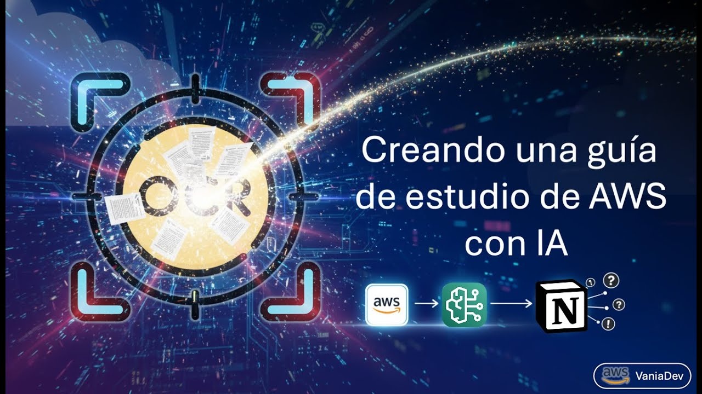

# 🎓 AWS Exam Questions AI

[](https://github.com/Vania-Dev/AWS-Exam-Qustons-AI-AWS/graphs/contributors)
[](https://github.com/Vania-Dev/AWS-Exam-Qustons-AI-AWS/forks)
[](https://github.com/Vania-Dev/AWS-Exam-Qustons-AI-AWS/stargazers)
[](https://github.com/Vania-Dev/AWS-Exam-Qustons-AI-AWS/issues)
[](https://github.com/Vania-Dev/AWS-Exam-Qustons-AI-AWS/blob/main/LICENSE.txt)

<!-- PROJECT LOGO -->
<br />
<div align="center">
  <a href="https://github.com/Vania-Dev">
    
  </a>

  <h3 align="center">Curso de Simulación Matematica de Yacimientos</h3>

  <a href="https://www.youtube.com/watch?v=F5r-0cj7tsU">
    
  </a>

  <p align="center">
    <br />
    <br />
    <a href="https://github.com/Vania-Dev/AWS-Exam-Qustons-AI-AWS">Material adicional</a>
    ·
    <a href="https://github.com/Vania-Dev/AWS-Exam-Qustons-AI-AWS/issues/new?labels=bug&template=bug-report---.md">Reportar un Error</a>
    ·
    <a href="https://github.com/Vania-Dev/AWS-Exam-Qustons-AI-AWS/issues/new?labels=enhancement&template=feature-request---.md">Solicitar una mejora</a>
  </p>
</div>

## ✨ About Project

Automatically process AWS exam question images using AI and save results to Notion.

## 🚀 What it does

1. 📦 **Gets images** from S3 bucket (when uploaded)
2. 📝 **Extracts text** from images using AWS Textract
3. 🤖 **Analyzes questions** using AWS Bedrock (Claude AI)
4. 💾 **Saves results** to Notion with explanations

## 📁 Project Structure

```
AWS-Exam-Qustons-AI-AWS/
├── 📄 main.py                 # AWS Lambda entry point
├── 🔄 aws_question_agent.py   # Main processing workflow
├── 📂 utils/
│   ├── 👁️ ocr.py              # Text extraction from images
│   ├── 🧠 llm.py              # AI question analysis
│   └── 📓 notion.py           # Save results to Notion
├── 🖼️ images/
│   ├── vaniadev.png
│   └── video.jpg
├── 📋 requirements.txt        # Python dependencies
├── 📦 pyproject.toml          # Project configuration
├── 🔒 uv.lock                 # Dependency lock file
├── 🐍 .python-version         # Python version
├── 🚫 .gitignore              # Git ignore rules
└── 📜 LICENSE.txt             # MIT License
```

## ⚙️ Setup

### 1. 📥 Install Dependencies
```bash
pip install -r requirements.txt
```

### 2. ☁️ AWS Configuration
```bash
aws configure
# Enter your AWS credentials
```

### 3. 🔐 Environment Variables
Create `.env` file:
```
NOTION_TOKEN=your_notion_token
NOTION_PARENT_PAGE_ID=your_page_id
AWS_DEFAULT_REGION=us-east-1
```

### 4. 🔑 AWS Permissions
Your AWS user needs:

**📦 Bucket S3**

- `s3:GetObject`
- `s3:PutObject`
- `s3:ListBucket`

**⚡ AWS Lambda**

- `s3:GetObject`
- `s3:PutObject`
- `s3:ListBucket`
- `textract:DetectDocumentText`
- `textract:AnalyzeDocument`
- `bedrock:InvokeModel`
- `bedrock:InvokeModelWithResponseStream`
- `bedrock:ListFoundationModels`

## 💻 Usage

### 🧪 Local Testing
```bash
python main.py
```

### 🚀 AWS Lambda Deployment
1. 📦 Zip your code
2. ⚡ Create Lambda function
3. 🔗 Set up S3 trigger
4. 📤 Upload images to S3 bucket

## 🔄 How it Works

1. 📤 **Image Upload**: Upload exam question image to S3
2. 📝 **Text Extraction**: Textract reads text from image
3. 🤖 **AI Analysis**: Bedrock analyzes question and options
4. ✅ **Result**: JSON with correct answers and explanations in Spanish
5. 💾 **Storage**: Saves to Notion page

## 📊 Example Output
```json
{
    "object": "list",
    "results": [
        {
            "object": "block",
            "id": "304e03e4-e8f292f7c03fd7",
            "parent": {
                "type": "page_id",
                "page_id": "2a3e03e9f057a7658"
            },
            "created_time": "2026-02-11T02:05:00.000Z",
            "last_edited_time": "2026-02-11T02:05:00.000Z",
            "created_by": {
                "object": "user",
                "id": "552fab0081-37d835ab8c90"
            },
            "last_edited_by": {
                "object": "user",
                "id": "552fab00-335ab8c90"
            },
            "has_children": true,
            "archived": false,
            "in_trash": false,
            "type": "numbered_list_item",
            "numbered_list_item": {
                "rich_text": [
                    {
                        "type": "text",
                        "text": {
                            "content": "Your company uses Amazon EMR clusters to analyze its workloads regularly. The data science\nteam leaves these EMR clusters running even after the task completes. The idle resources cause\nunnecessary costs for the company, and the CFO notices a rise in resource costs. She wants you\nto find a solution to terminate the idle clusters.\nWhat would you suggest as the BEST viable automated solution?",
                            "link": null
                        },
                        "annotations": {
                            "bold": false,
                            "italic": false,
                            "strikethrough": false,
                            "underline": false,
                            "code": false,
                            "color": "default"
                        },
                        "plain_text": "Your company uses Amazon EMR clusters to analyze its workloads regularly. The data science\nteam leaves these EMR clusters running even after the task completes. The idle resources cause\nunnecessary costs for the company, and the CFO notices a rise in resource costs. She wants you\nto find a solution to terminate the idle clusters.\nWhat would you suggest as the BEST viable automated solution?",
                        "href": null
                    }
                ],
                "color": "default"
            }
        }
    ],
    "next_cursor": null,
    "has_more": false,
    "type": "block",
    "block": {},
    "request_id": "d0bfaddd-8a9d44cb0f56"
}
```

## 📦 Dependencies

- 🔧 `boto3` - AWS SDK
- 🤖 `langchain-aws` - AWS Bedrock integration
- 🔀 `langgraph` - Workflow management
- 📓 `PyToNotion` - Notion API
- 🔗 `langchain-community` - Utilities for langchain
- 💎 `langchain-core` - Utilities for langchain
- 📐 `pydantic` - Structure management
- 🔢 `numpy` - Numpy

## 📝 Notes

- 🖼️ Works with PNG, JPG image formats
- ✅ Supports multiple choice questions (A, B, C, D)
- 🇪🇸 Explanations are provided in Spanish
- 🔐 Requires AWS Bedrock model access

<!-- LICENSE -->
## 📄 License

Distributed under the MIT license. See the `LICENSE.txt` file for more information.

<!-- CONTACT -->
## 📧 Contacto

[](https://youtube.com/@VANIADEV)
[](https://www.instagram.com/vania_dev_/)
[](https://www.tiktok.com/@vania_dev_)
[](https://www.facebook.com/SMAEMX)
[](https://beacons.ai/vaniadev)
[](https://www.linkedin.com/in/ivan-castaneda-nazario/)
[](https://vaniadev.super.site/)
[](https://buymeacoffee.com/vania_vaniusha)

---

<div align="center">

**Hazlo con el tipo de ❤️ que deja huellas en el alma**

[⭐ Star this repo](https://github.com/Vania-Dev/AWS-Exam-Qustons-AI-AWS) • [🐛 Report Bug](https://github.com/Vania-Dev/AWS-Exam-Qustons-AI-AWS/issues) • [✨ Request Feature](https://github.com/Vania-Dev/AWS-Exam-Qustons-AI-AWS/issues)

</div>